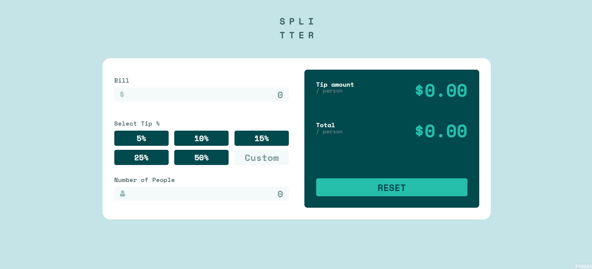
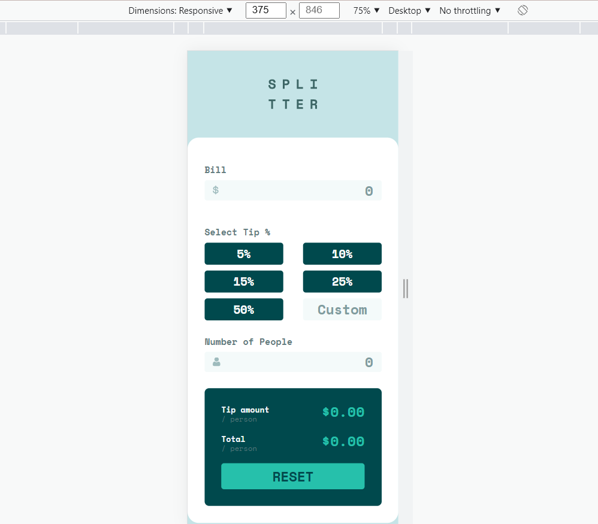
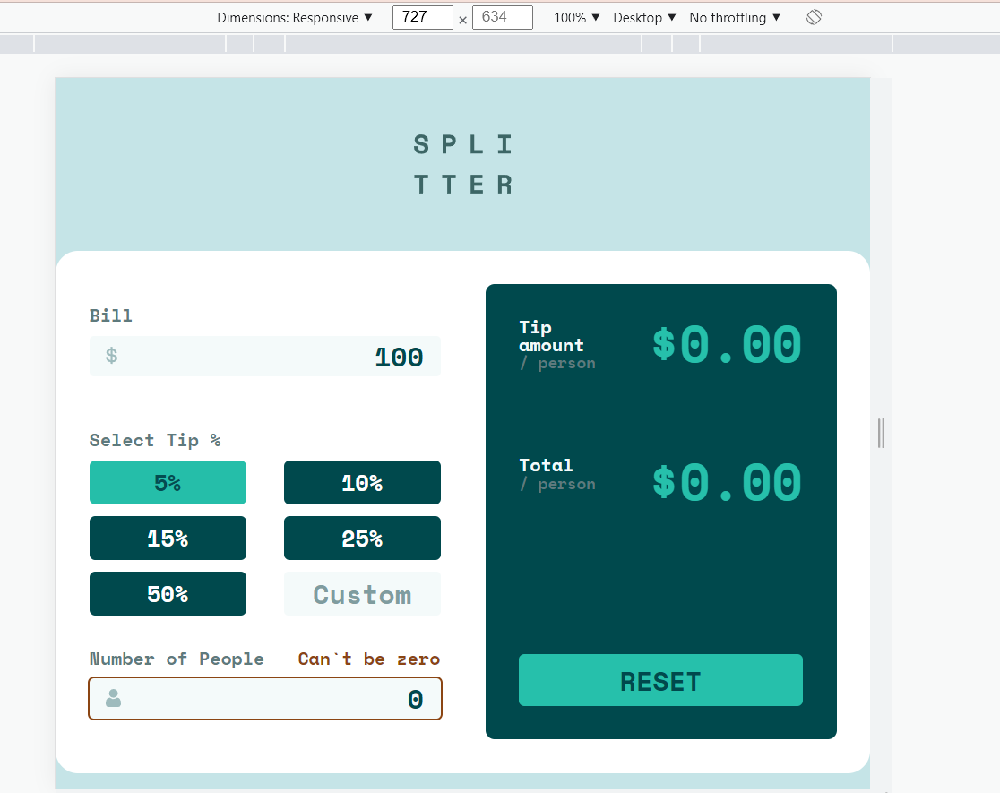
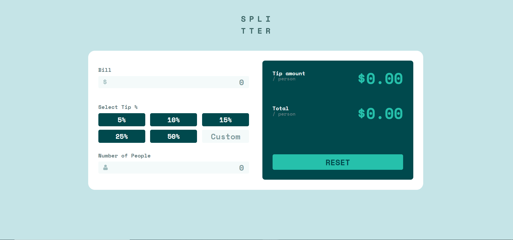

# Tip calculator

-----

### Visit

You can try it out: https://tip-calculator-egija.netlify.app/

---

---

### Responsiveness

---

### Tasks

- Implement assignment using:

    -   Language: **TypeScript**
    -   Framework: **React**

    Your users should be able to:

    - View the optimal layout for the app depending on their device's screen size
    - See hover states for all interactive elements on the page
    - Calculate the correct tip and total cost of the bill per person

Your task is to build out the project to the designs inside the `/design` folder. You will find both a mobile and a desktop version of the design.
The designs are in JPG static format. Using JPGs will mean that you'll need to use your best judgment for styles such as `font-size`, `padding` and `margin`.
You will find all the required assets in the `/images` folder. The assets are already optimized. There is also a `style-guide.md` file containing the information you'll need, such as color palette and fonts.

---

### Install 

### `npm install`

### Running the project

### `npm start`

Open [http://localhost:3000](http://localhost:3000) to view it in the browser.

### Test 

### `npm test`
